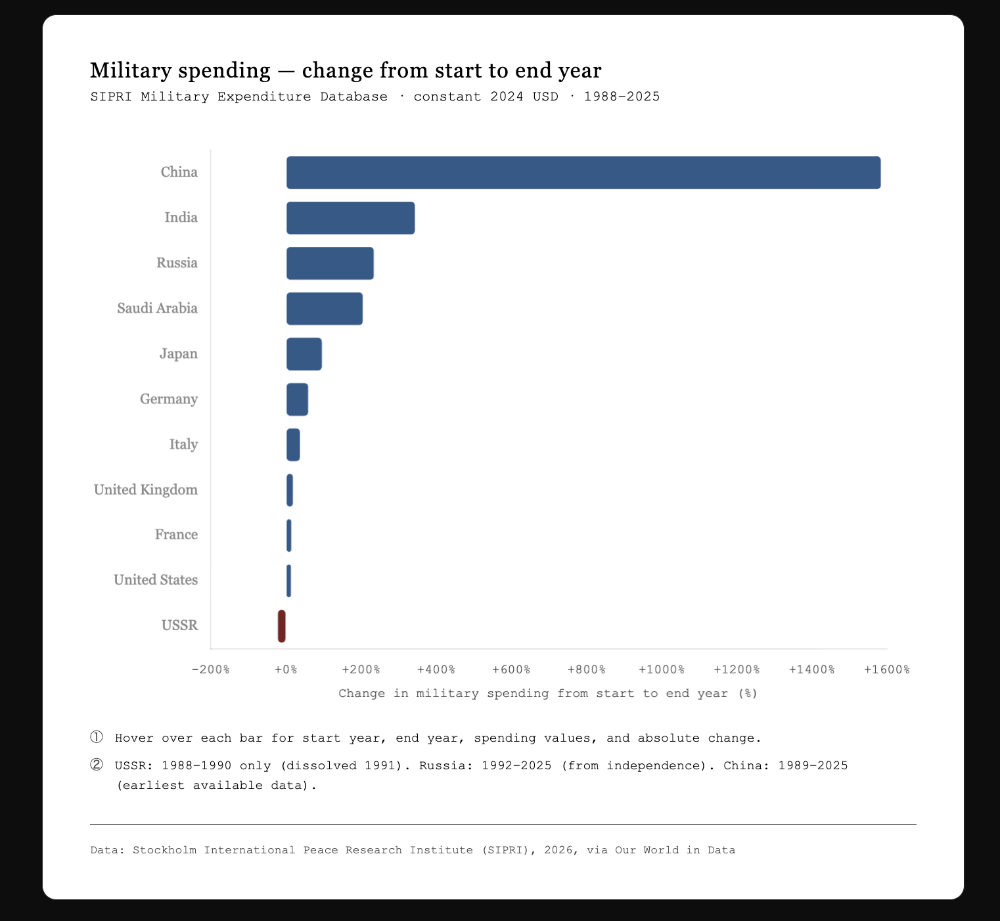
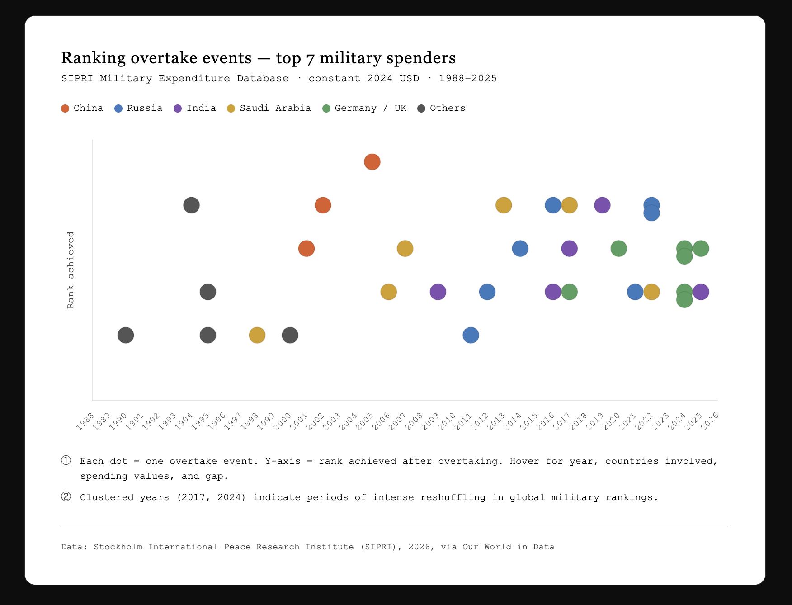
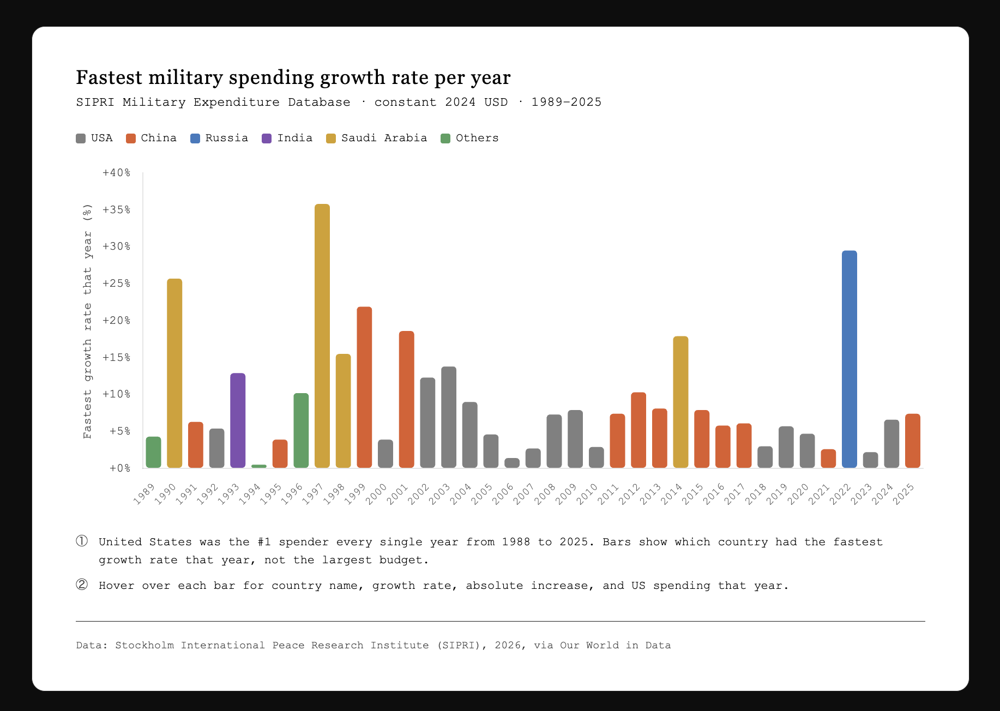
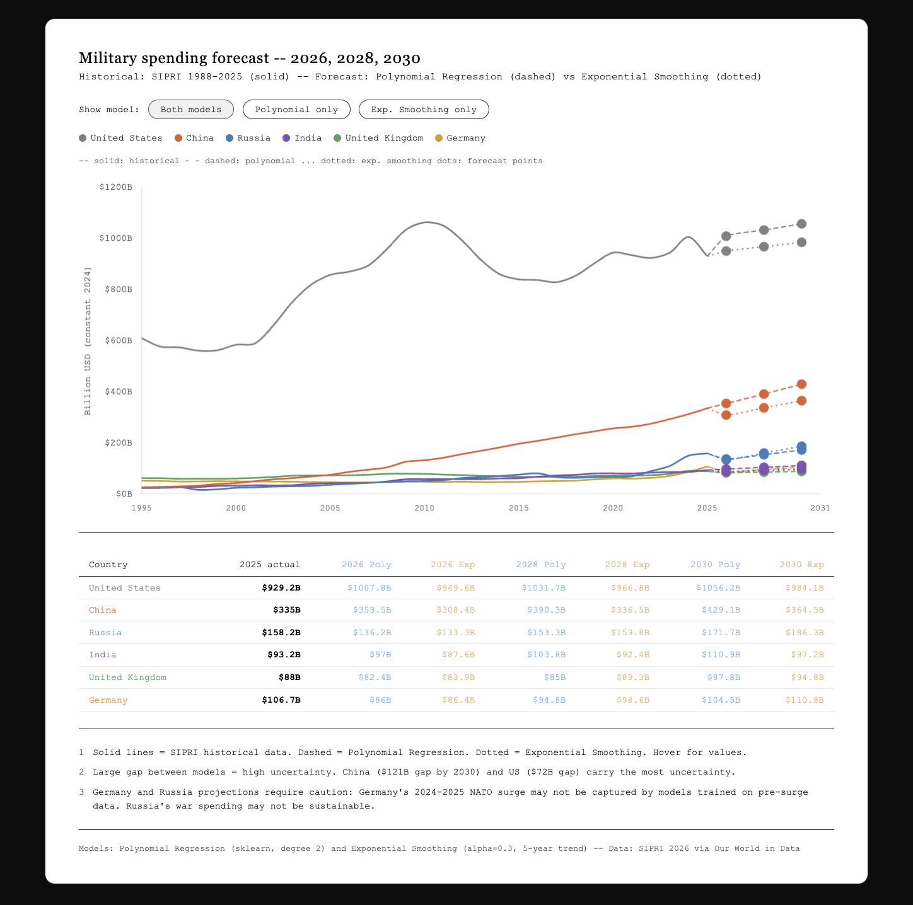

# Global Military Spending Analysis (1988–2030)

**Which countries are spending the most on their military — and who is catching up?**

A data analysis and visualization project covering global military expenditure from 1988 to 2025, with forecasts to 2030. Built with Python and Chart.js.

---

## Bar Chart Race Video

*Which country has the most military spending? (1988–2025)*


The video animates the rise and fall of global military powers over 37 years —
including the collapse of the USSR, China's steady climb to #2, and Russia's dramatic resurgence.

---

## Key Findings

### 1. Spending Change — Start to End Year



> 🔗 [Interactive version](charts/chart1_comparison.html)

| Country | Start | End | Change |
|---------|-------|-----|--------|
| 🇨🇳 China | $19.9B (1989) | $335.0B (2025) | **+1,583%** |
| 🇮🇳 India | $21.1B (1988) | $93.3B (2025) | **+343%** |
| 🇷🇺 Russia | $47.5B (1992) | $158.2B (2025) | **+233%** |
| 🇸🇦 Saudi Arabia | $26.8B (1988) | $81.5B (2025) | **+204%** |
| 🇯🇵 Japan | $30.5B (1988) | $59.5B (2025) | **+95%** |
| 🇩🇪 Germany | $67.2B (1988) | $106.7B (2025) | **+59%** |
| 🇬🇧 United Kingdom | $74.4B (1988) | $88.0B (2025) | **+18%** |
| 🇫🇷 France | $56.7B (1988) | $64.5B (2025) | **+14%** |
| 🇺🇸 United States | $821.4B (1988) | $929.2B (2025) | **+13%** |
| 🇷🇺 USSR | $282.9B (1988) | $221.9B (1990) | **−22%** |

**Key insight:** The US grew just 13% in 37 years — yet still spends 2.8× more than China.
Western powers maintained dominance through existing scale, not growth.

---

### 2. Ranking Overtake Events (33 events, 1988–2025)



> 🔗 [Interactive version](charts/chart2_events.html)

**Most turbulent years:**
- **2017** — 4 events: Russia collapsed in rankings after oil/sanctions crash; India, Saudi Arabia, and UK all leapfrogged it
- **2024** — 4 events: Germany's NATO-driven surge; UK climbed back
- **2022** — 3 events: Russia's Ukraine invasion triggered a +29.5% spike, pushing it back to #3

**China's methodical climb (never reversed):**
- 2001: Overtook Germany → #4
- 2002: Overtook France → #3
- 2005: Overtook UK → **#2**, where it has remained ever since

**Russia: most volatile (9 events — both up and down)**
Russia alone accounts for 27% of all overtake events, swinging between #3 and #7 multiple times.

---

### 3. Fastest Growth Rate per Year (1989–2025)



> 🔗 [Interactive version](charts/chart3_growth.html)

**Top single-year growth spikes:**
| Year | Country | Growth Rate | Context |
|------|---------|-------------|---------|
| 1997 | 🇸🇦 Saudi Arabia | **+35.8%** | Oil boom |
| 2022 | 🇷🇺 Russia | **+29.5%** | Ukraine invasion |
| 1990 | 🇸🇦 Saudi Arabia | **+25.7%** | Gulf War |
| 1999 | 🇨🇳 China | **+21.9%** | WTO accession period |

**Note:** The United States was the #1 spender every single year from 1988 to 2025 —
bars show fastest *growth rate*, not largest budget.

**China was the fastest-growing country in 15 out of 37 years.**
Its growth rate has slowed from 20%+ in the 1990s to 6–8% in the 2020s,
but absolute dollar increases keep growing as the base expands.

---

### 4. Forecast to 2026, 2028, 2030



> 🔗 [Interactive version](charts/chart4_forecast.html)

Two models used for comparison:
- **Polynomial Regression** (degree 2) — captures long-run structural trends
- **Exponential Smoothing** (alpha=0.3) — weights recent years more heavily

| Country | 2025 Actual | 2026 Poly/Exp | 2028 Poly/Exp | 2030 Poly/Exp |
|---------|-------------|---------------|---------------|---------------|
| 🇺🇸 United States | $929B | $1,008B / $950B | $1,032B / $967B | $1,056B / $984B |
| 🇨🇳 China | $335B | $354B / $308B | $390B / $337B | $429B / $365B |
| 🇷🇺 Russia | $158B | $136B / $133B | $153B / $160B | $172B / $186B |
| 🇮🇳 India | $93B | $97B / $88B | $104B / $92B | $111B / $97B |
| 🇩🇪 Germany | $107B | $86B / $86B | $95B / $99B | $105B / $111B |
| 🇬🇧 United Kingdom | $88B | $82B / $84B | $85B / $89B | $88B / $95B |

**Three critical forecast insights:**

**Russia is projected to decline from 2025 levels** — both models predict war-level spending
($158B) is unsustainable. If conflict ends, actual spending may fall to $130–150B range.

**China's uncertainty gap is $121B by 2030** — the largest of any country.
Polynomial captures historic acceleration; exponential smoothing reflects recent deceleration.
This divergence is not a model flaw — it reflects genuine uncertainty about China's trajectory.

**Germany and UK projections are likely underestimates** — both models were trained on
pre-2024 data. If Germany sustains its NATO 2% GDP commitment, actual spending will
significantly exceed both projections.

---

## Repository Structure

```
bar-chart-race-military/
├── data/
│   └── military-spending-sipri.csv        # Raw SIPRI data via Our World in Data
├── charts/
│   ├── chart1_comparison.html             # Interactive: spending change by country
│   ├── chart2_events.html                 # Interactive: ranking overtake events
│   ├── chart3_growth.html                 # Interactive: fastest growth rate per year
│   └── chart4_forecast.html              # Interactive: forecast to 2030
├── military_spending_analysis.ipynb       # Full analysis + chart generation notebook
├── military_spending_analysis_v3.py       # Data processing + CSV generation script
├── bar_chart_race_data.csv                # Formatted data for bar chart race video
├── events_table.csv                       # 33 ranking overtake events
├── growth_summary.csv                     # Fastest growing country per year
├── comparison_table.csv                   # Start vs end year comparison
└── README.md
```

---

## How to Run

**Requirements:**
```bash
pip install pandas numpy scikit-learn
```

**Step 1:** Generate CSV analysis files
```bash
python military_spending_analysis_v3.py
```

**Step 2:** Run the full notebook (generates all 4 HTML charts)
```bash
jupyter notebook military_spending_analysis.ipynb
```

**Step 3:** Open any chart directly in your browser
```bash
open charts/chart1_comparison.html
```

---

## Tools Used

| Category | Tools |
|----------|-------|
| Data Analysis | Python, Pandas, NumPy |
| Machine Learning | Scikit-learn (Polynomial Regression, Exponential Smoothing) |
| Visualization | Chart.js (interactive HTML charts) |
| Bar Chart Race | Python (Matplotlib, custom vertical format) |
| Environment | Jupyter Notebook |

---

## Data Source & Citation

**Stockholm International Peace Research Institute (SIPRI), 2026 — via Our World in Data**

> Stockholm International Peace Research Institute (2026) – with minor processing by Our World in Data.
> "Military expenditure" [dataset]. SIPRI Military Expenditure Database.

All figures are in **constant 2024 US dollars** (inflation-adjusted).
Data covers 1949–2025; this analysis uses 1988–2025.

**License:** SIPRI data is publicly available for non-commercial use with attribution.
Analysis code in this repository is released under the MIT License.

---

## Notes on USSR vs Russia

USSR and Russia are treated as **two separate entities**:
- **USSR**: data available 1988–1990 only (dissolved December 1991)
- **Russia**: data begins 1992 (first year as independent state)

Russia's 1992 spending ($47.5B) was **17% of USSR's 1988 spending ($282.9B)** —
one of the most dramatic military contractions in modern history.
